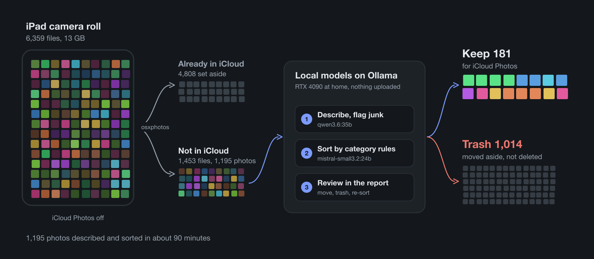
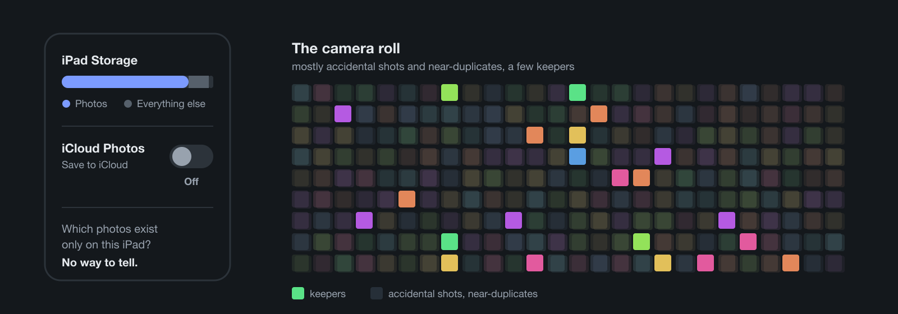
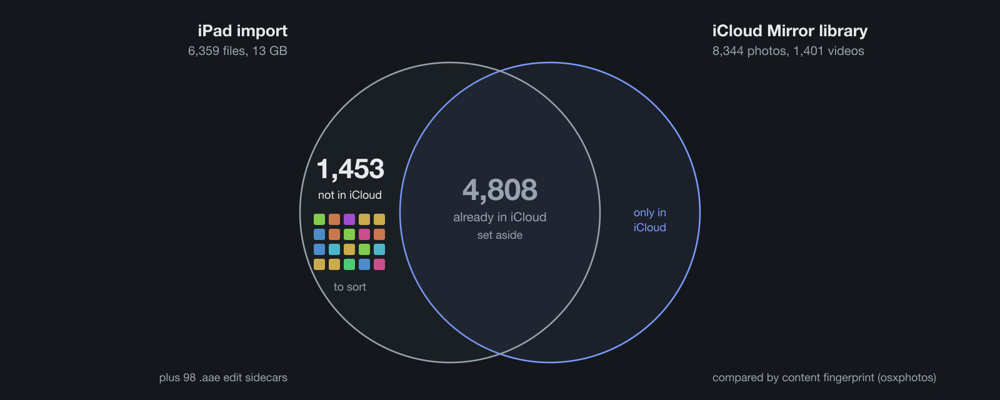
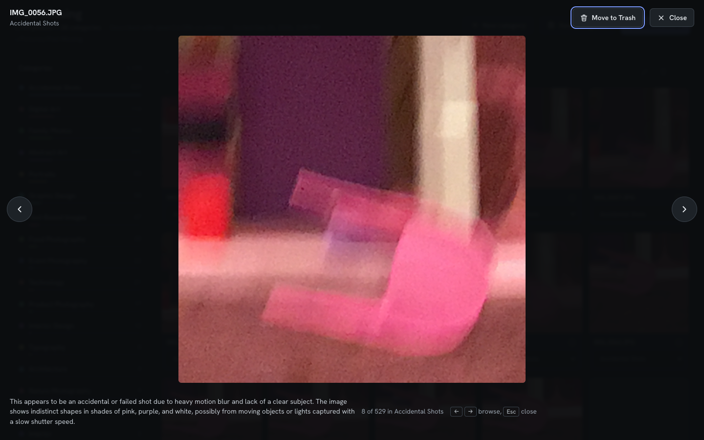
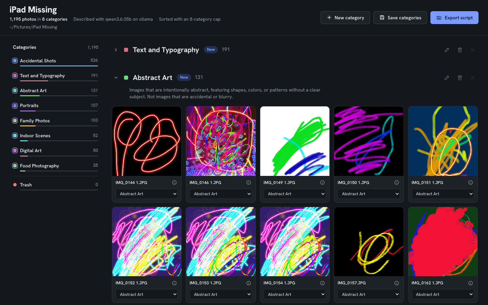
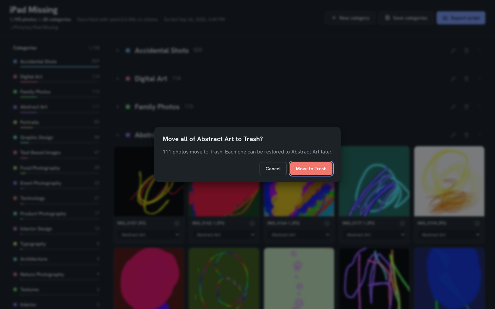
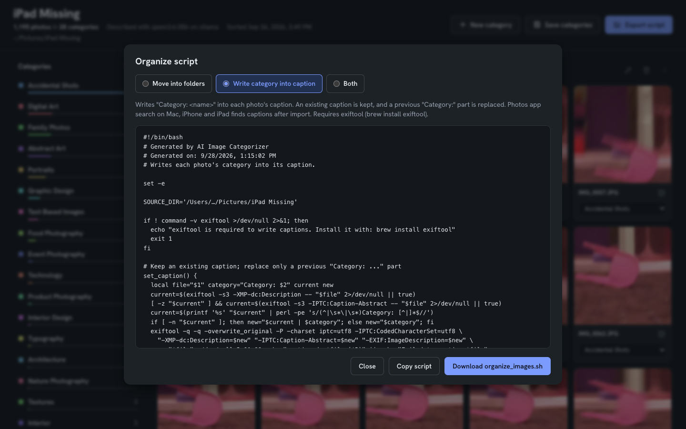
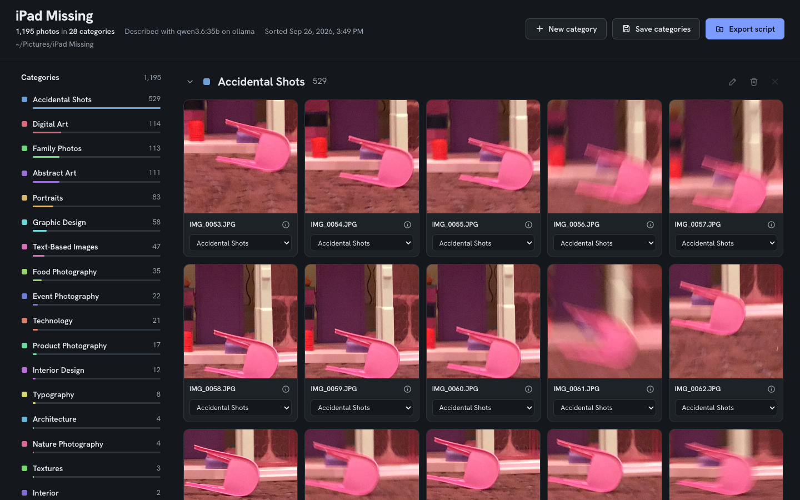

By Benedict Porkins, [benedict.porkins@gmail.com](mailto:benedict.porkins@gmail.com)

{fig-alt="Diagram: the iPad camera roll, 6,359 files, is compared with iCloud; 4,808 files already in iCloud are set aside and 1,453 go to local models on Ollama that describe, sort and let a person review them; the result is 181 photos kept for iCloud Photos and 1,014 moved to Trash."}

## The problem

My kids have an old iPad they use for games, learning apps and, as it turned
out, a great deal of photography. When it ran out of storage, the photos were
the reason.

Clearing them was not as simple as deleting them. iCloud Photos had been turned
off on the iPad ("Save to iCloud" set to Off), so its library had never been
uploaded. Some of those photos might already be in iCloud from other devices;
others might exist only on the iPad. The iPad could not tell me which were which,
and deleting the wrong ones would lose them for good.

*In short: no way to tell what was safe to delete.*

Most of what was there was not worth keeping. A camera in a child's hands
produces accidental shots: blurred frames, the floor, the same pink chair
photographed dozens of times from slightly different angles (it is, to be
fair, a very photogenic chair), finger drawings saved from a paint app. Mixed
in with them were the photos I did want to keep: portraits and family pictures.

*In short: mostly junk, some keepers.*



So the job had three parts:

- Get everything off the iPad, so the storage could be freed.
- Remove the junk without looking at several thousand files one by one.
- Put only the keepers into iCloud Photos.

## The options

The first idea was an iPad app with full access to the photo library, which
could sort and delete in place. It turned out to be unnecessary: plugging the
iPad into a Mac and importing over USB gets every original file, and once the
files are on the Mac, any tool can work on them.

Next I looked at what already exists:

- **Immich** and **PhotoPrism** are self-hosted photo libraries with AI tagging.
- **osxphotos** exports and queries the Mac's Photos library and finds duplicates.
- Apple's own **Duplicates** album in Photos finds duplicate shots.

Each does part of the job. None of them answers the question I actually had:
which of these photos are junk, and where should the rest go?

That left manual review. At a few thousand files, a good number of them of the same
chair, it was too slow to be a real option.

## What I chose and why

The plan was to split the problem in two. First, work out which photos were
already safe in iCloud and set them aside. Then deal only with what was left,
and let software decide what was junk.

**Getting everything off the iPad.** Image Capture on the Mac imported the whole
camera roll over USB: 6,359 files, 13 GB. 98 of them were `.aae` files, the
sidecars in which iOS records edits. That import stays untouched as a backup.

*In short: the whole iPad, backed up on the Mac.*

**Finding a clean copy of iCloud.** The obvious reference would have been the
Mac's own Photos library, but it was not syncing with iCloud either: 1,570
items, 996 of them marked as not uploaded. Turning iCloud Photos on there would
have uploaded that library's junk along with everything else. So I created a new,
empty Photos library, named it "iCloud Mirror", made it the System Photo Library,
and turned on iCloud Photos with Optimize Mac Storage. It synced down to 8,344
photos and 1,401 videos: a clean copy of what iCloud holds, and nothing else.

*In short: iCloud, copied to the Mac.*

**Comparing the two.** osxphotos compared every file from the iPad against that
library, using the content fingerprints Photos keeps for each item. The result:

- 4,808 files were already in iCloud.
- 1,453 were not: 1,167 JPG, 241 MOV, 25 PNG, 12 HEIC, 5 MP4, 2 JPEG and 1 WEBP.

*In short: 1,453 files were not in iCloud.*



The 1,453 files, 2.3 GB, went into a separate folder. They were the only part of
the iPad that still needed a decision, and that is where the image categorizer
came in.

## How the categorizer works

The image categorizer is a small command-line tool I had started in early 2025
and brought up to date for this. Everything runs locally: two models served by
Ollama on a home server with an RTX 4090, `qwen3.6:35b` for looking at photos and
`mistral-small3.2:24b` for sorting them. No photo leaves the house.

**Step 1: describe.** The vision model looks at each photo on its own and returns
a short description and a few suggested categories. The first version sorted by
subject only, and blurred frames came back as "Abstract Art", which is generous.
So the prompt now asks it to judge the photo before describing it:

> First judge photo quality: is this an accidental or failed shot (heavy motion
> blur, out of focus, pointed at the floor or ceiling, lens covered, no clear
> subject)?

Accidental shots are labelled as such, whatever they show. This is the slow step,
and it runs once; the descriptions are saved as it goes.

*In short: each photo described, junk flagged.*



**Step 2: sort.** The text model reads the descriptions, never the photos, and
puts each photo into a category. Each category has a rule that says what belongs
in it:

```yaml
- name: Portraits
  rule: Photos of people looking at the camera, including selfies. Not group photos.
```

The rules are what keep "Portraits" and "Self Portraits" from turning into two
categories. The list is saved and reused on the next library; a new category is
proposed only when enough photos fit none of the existing rules. Because this step
works from text, it takes minutes and can be rerun as often as needed.

*In short: descriptions sorted into categories with rules.*



**Step 3: review.** The result is a report in the browser: every photo grouped by
category, with counts down the side. Photos can be dragged between categories,
and a whole category can go to Trash in one step. If a category collects photos
that belong elsewhere, a re-sort takes a plain-language note ("photos where a face
is clearly visible belong in Portraits"), turns it into rule changes, and sorts
that category again.

*In short: a person checks the result.*




**Step 4: apply.** The report does not touch the files. It exports a shell script
that moves each photo into a folder named after its category, writes the category
into the photo's caption so the Photos app can search for it, or both. Nothing is
deleted; trashed photos go to a folder called Trash.

*In short: a script does the moving.*



## The results

Of the 1,453 files, 1,195 were photos the tool could read. The other 258 were
246 videos and 12 HEIC files, which it skips.

**Describing** took about 80 minutes for the 1,195 photos, with no failures. The
vision model flagged 527 of them as accidental shots on its own.

**Sorting** took about 8 minutes, in 30 batches of 40 photos. It produced 28
categories. The largest were Accidental Shots (529), Digital Art (114), Family
Photos (113), Abstract Art (111), Portraits (83), Graphic Design (58) and
Text-Based Images (47).

*In short: 1,195 photos sorted in about 90 minutes.*



The first run was not perfect. In two of the 30 batches the model put a few
photos into categories that were not on its list, and the tool rejected the whole
batch, so 80 photos kept rough first guesses. The fix was to keep the valid
answers and ask again only about the photos that came back wrong; a rerun on those
80 placed all of them. The 28 categories were also more than a family photo
library needs, so the tool now saves its category list, with a rule for each
category, and can cap its size.

*In short: one bug fixed, one design change.*

**Reviewing** went by category rather than by photo. Whole categories, such as
the 111 in Abstract Art, went to Trash in one step; mixed categories got a closer
look. The review ended with:

- 1,014 photos in Trash.
- 181 kept, in five categories: Family Photos (104), Portraits (39), Food
  Photography (35), Interior Design (2) and Event Photography (1).

*In short: 181 of 1,195 photos kept.*

## What's left to do

**Apply the decisions.** Run the exported script, so the photos are moved into
their folders and captioned.

**Upload the keepers.** Import the 181 kept photos into Photos, so that they
upload to iCloud like everything else.

**Handle what the tool skipped.** The 246 videos and 12 HEIC files still need a
decision.

**Clean the Mac's own library.** The Mac's old Photos library, with its 996 items
marked as not uploaded, needs the same treatment before iCloud Photos is turned on
there.

*In short: apply, upload, then repeat on the Mac.*

## The code

The categorizer is open source:
[github.com/DrBenedictPorkins/image-categorizer](https://github.com/DrBenedictPorkins/image-categorizer).

It is built for developers. The repository includes a setup guide written for AI
coding agents: open it in Claude Code, ask it to follow `SETUP.md`, and it checks
the machine, configures Ollama and the models, and runs a test on a set of sample
images. You need an Ollama server with a GPU; the tested pair of models needs
24 GB of GPU memory, and the guide lists smaller, untested pairs for 8 to 16 GB.

One experiment I have not tried yet: running the whole thing on the laptop
itself. Ollama runs natively on Apple Silicon, and its library now includes MLX
builds of some models, such as `qwen3.6:27b-mlx`, which use Apple's own machine
learning framework. On a Mac with enough unified memory, such as the M3 Max in my MacBook Pro, the
describe and sort steps could run without the GPU server at all. How the speed
and the quality of the descriptions compare to the RTX 4090 is the next thing to
find out.

